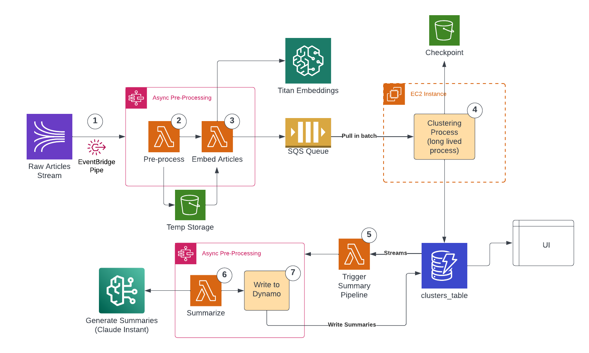
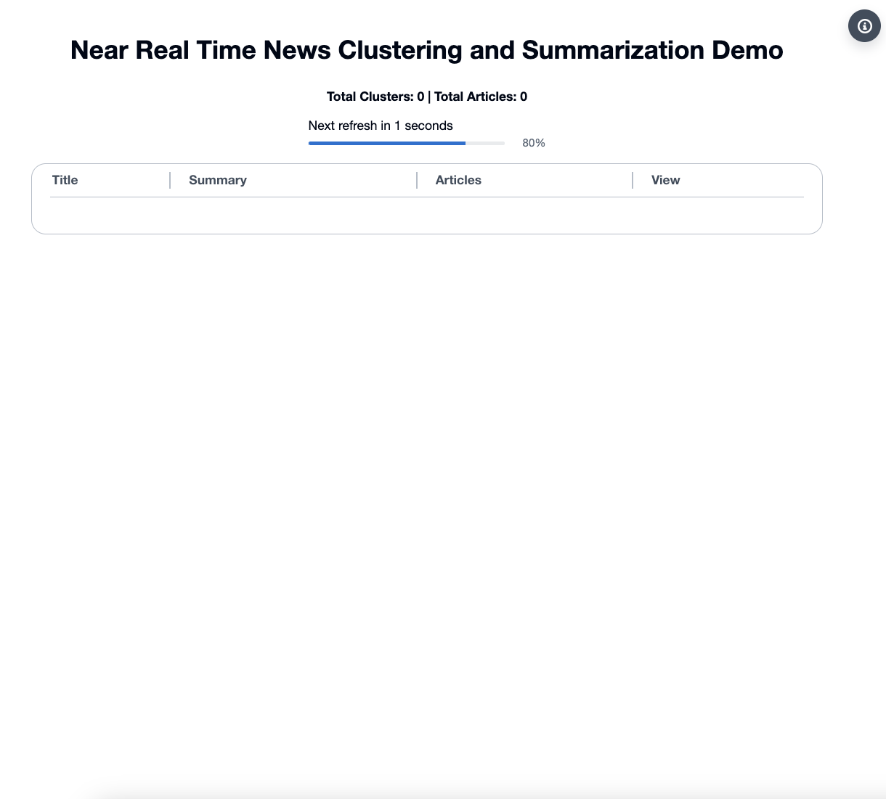
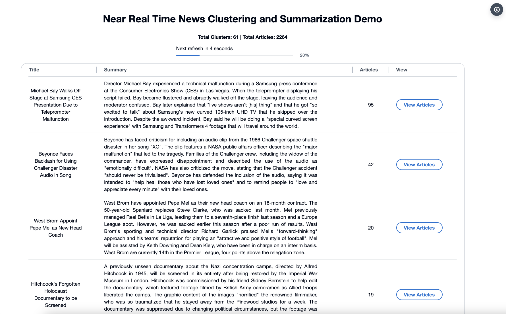

# News Clustering And Summarization

## Table of Contents
1. [About this Repository](#About)
2. [Architecture](#Architecture)
3. [Demo](#Demo)
4. [Tool Versions](#Versions)
5. [Prerequisites](#Prerequisites)
6. [Build and Deploy](#Build_Deploy)
7. [Test](#Test)
8. [Destroy](#Destroy)
9. [License](#License)

## About this Repository <a name="About"></a>

### News Clustering And Summarization

This solution aims to launch a news Event feature that clusters related news stories into summaries, providing customers with near real-time updates on unfolding events. 
This augmented news consumption experience will enable users to easily follow evolving stories while maximizing relevance and reducing the firehose of information for articles covering the same event. By tailoring news clusters around key events, this application can improve customer satisfaction and engagement.

This project was built by the AWS GFS SA team, FSI PACE team and the Generative AI Innovation Center.

### Repository Details

Below are some descriptions of the content in this repository.
```
artifacts/                                  # Contains the architecture diagram and demo gif
build-script/                               # Hosts required build scripts
    |--- build.sh                           # Creates and Uploads docker image for the Lambda function
    |--- dir_md5.sh                         # Trigger the rebuild of docker image once the underlying code changes
business_logic/                             # Hosts the necessary artifacts and logic to run the solution
    |--- lambdas/                           # Each folder contains a .py file and a requirements.txt to run the code
        |--- embed_docs/                    # Takes a list of processed documents and embeds with SageMaker endpoint
        |--- preprocess_docs/               # Generates the string to embed, by concatenating relevant fields
        |--- summarization/                 # Generates the summary of a list of articles
        |--- trigger_sfn/                   # Determines if the added articles should trigger a new summarization or if we should wait
    |--- model_artifacts/                   # Necesary artifacts to deploy the embedding model
        |--- embedding/         
            |--- model/
                |--- code/
                    | inference.py          # In specific SageMaker format for handling inputs and outputs, and invoking model
                    | requirements.txt      # List of requirements for model to run
                |--- model/                 # Contains the code for importing and running model
    |--- stream_consumer/                   # Contains the code and requirements for the clsutering compute
    |--- example.json
data/                                       # For testing data upload to kinesis stream
    |--- customer_data/                     # DOES NOT CURRENTLY EXIST, place json documents in here to have them accessible for testing
    |--- put_records.py                     # Pushes files from customer_data to kinesis stream for processing
    |--- clear_data.py                      # Clears the DynamoDB table, SQS queue, S3 bucket DBSCAN memory and removes the EC2 instance from the ASG
    |--- send_articles.sh                   # Sends articles to the kinesis stream for processing to simulate a data feed
frontend/                                   # Front end code for demo purposes
iac/                                        # All infrastructure as code
    |--- roots/                             
        |--- main/
            |--- _globals.tf
            |--- backend.tf
            |--- clustering_compute.tf      # Deploys the clustering compute
            |--- dynamodb.tf                # Creates the table that contains cluster information
            |--- embedding_endpoint.tf      # Deploys the embedding SageMaker endpoint
            |--- eventbridge.tf             # Creates the EventBridge pipe
            |--- iam.tf                     # Defines IAM policies and roles
            |--- lambda.tf                  # Builds all necessary lambda functions
            |--- main.tf                    # Creates some S3 buckets, Kinesis streams, and Step Function for ingestion
            |--- outputs.tf                 # Not used in this solution
            |--- summarization_pipeline.tf  # Deploys the summarization Step Functions
            |--- terraform.tfvars           # Defines app and environment names
            |--- variables.tf               # Necessary variables
            |--- vpc.tf                     # Creates VPC and other necessary networking
        |--- README.md
    |--- templates/
Makefile                                    # Simplifies scripts for easy deployment 
README.md                                   # File you are currently reading with details on how to operate the solution
```

## Architecture <a name="Architecture"></a>



This solution leverages a combination of AWS managed services and serverless options to create a scalable, event-driven, microservice architecture capable of processing up dozens or news artcles per second.  The architecture utilizes AWS Lambda, Step Functions, Amazon Kinesis, EventBridge (Pipes), DynamoDB, EC2 with Auto Scaling Groups, S3, and Amazon Bedrock.

The workflow begins with raw JSON article ingestion through Amazon Kinesis, bridged to Step Functions via EventBridge Pipes. The first Step Functions state machine preprocesses documents and embeds articles using Titan Embeddings on Bedrock. Data is temporarily stored in S3 between steps to handle large payloads. Processed articles are then sent to SQS for micro-batch clustering.

Clustering occurs on EC2 instances, which pull batches from SQS and apply the DBSCAN algorithm. Results update a DynamoDB table, with periodic checkpoints saved to S3. DynamoDB Streams trigger summarization pipelines when clusters reach a specified threshold. Summaries are generated using Claude Haiku through another Step Functions workflow and stored back in DynamoDB for UI access.

This architecture ensures high scalability, fault tolerance, and near real-time processing of large volumes of articles, making it suitable for applications requiring rapid content analysis and clustering.

## Demo <a name="Demo"></a>

Below is a GIF that demostrates the solution in action. 


The demo demostrates the solution by sending articles to the Kinesis stream, and waiting those articles to be clustered and summarized. The web UI gets updated every 5 seconds reading the DynamoDB table which contains the clusters, articles and summaries.

## Tool Versions <a name="Versions"></a>

To build and deploy this template the following tools are required.

1. AWS CLI >= 2
2. Terraform >= 1.4.6
3. Docker
4. md5

## Prerequisites <a name="Prerequisites"></a>

### Credentials

Use the secret access key of a user or export the temporary credentials.

### Environment

The environment and application are current defined as below in ```iac/roots/main/terraform.tfvars```:
```
appName = "clustering"
envName = "demo2"
```
To edit these values navigate to ```iac/roots/main/terraform.tfvars``` and manually change them.

### Understanding the MakeFile

At the root of the repository there is a ```Makefile```. This has custom commands to abstract some of the terraform commands for ease of use.

This includes the following commands:
```
# Terraform Init
init: 
	terraform -chdir=iac/roots/main init

# Deploy all targets in the correct order
deploy-all: 
	terraform -chdir=iac/roots/main apply -auto-approve

# Destroy all targets in the correct order
destroy-all:
	terraform -chdir=iac/roots/main apply -destroy 

# Send Articles
send-articles:
	cd data && ./send_articles.sh && cd ..

# Download Public Dataset
download-public-dataset:
	cd data && ./download_public_data.sh && cd ..

# Clear Data
clear-data:
	cd data && python clear_data.py && cd ..
```

In the next sections, we will explain when to use these commands.


### Init Terraform

To initialize terraform, run
```
make init
```

This will run ```terraform -chdir=iac/roots/main init```.


## Build and Deploy <a name="Build_Deploy"></a>

### Deploy

To deploy the resources, run:

```
make deploy-all
```

This will run ```terraform -chdir=iac/roots/main apply -auto-approve```.

### Accessing the Frontend

To access the frontend, you'll see the Terraform output that should look something like:

```
dns_record_for_application = "https://front-end-clustering-demo2-1234567890.us-east-1.elb.amazonaws.com"
sample_user_creds = tomap({
  "user1" = {
    "email" = "donotreply@amazon.com"
    "name" = "aws-user"
    "password" = "awsiscool$"
  }
})
```

Open the link in your browser. You should see the following login screen using the email and password provided in the output. 

The page should look like the following:



After you have logged in, please go ahead and start sending articles to the solution. You can follow the instrucions in the sections below. 

## Test <a name="Test"></a>

### Testing Infrastructure

Running ```make download-public-dataset``` will download a public dataset to ```data/public-data```. 

The following is an example of one of the items in the dataset. The solution expects the first 3 keys to be filled
```json
{
  "id": "66536",
  "text": "this is the body of the article", // ! Required
  "title": "Article Title", // ! Required
  "date": "2013-12-18 08:14:00", // ! Required
  "event_id": "9102",
  "duplicate": false,
  "lang": "deu",
  "bag_id": "b738a3b7-2db3-4d38-88c8-76c4eb4f835b-2325",
  "source": "finanzen.net",
  "cluster": "322"
}

```

> Note: Use this data for exploration/testing. You should use your own data for prod. Just ensure it has the same expected fields: text, title, and date.

### Installing Required Python Libraries

Before sending articles, ensure you have `boto3` and `tdqdm` python libraries installed. You can install them using the following command:

```bash
pip install boto3 tqdm
```

### Sending Articles

Running ```make send-articles``` will call on ```data/put_records.py```.

```put_records.py``` relies on the following global variables
```
STREAM_NAME = "input-stream-clustering-demo2"   # Name of Kinesis stream
PARTITION_KEY = "a"                         # Partition key of Kinesis stream (does not need editing)
JSON_DIR = "./customer_data"                # Path to article json files
COUNT = 1200000                             # Number of articles to test with (actual number run is min(COUNT, num articles in JSON_DIR))
BATCH_SIZE = 5                              # Number of articles to send as a batch to the Kinesis stream
```
Once you have sent articles, you should see them in the frontend. The frontend will display clusters as they are formed and updated in real time.
A screenshot of the frontend displaying news clusters is shown below:



Each row in the web UI displays a cluster, its summary, the number of articles in the cluster, and a link to see each articles in the cluster. If you click in the "View Articles" button, you are able to see each article in detail with title, date, and full text. 

*Note: after testing, it may be required to clear the SQS queue and the DyanmoDB table*

### Clearing Data 

Running ```make clear-data``` will clear the DynamoDB table, SQS queue, S3 bucket DBSCAN memory and remove the EC2 instance from the ASG. Please wait 5-10 minutes after deleting the data to send more news to the solution. It takes few minutes for the ASG to create a new EC2 instance.

If you changed the variables with a specific project name, you might need to edit the ```data/clear_data.py``` file to match the project name.

### Testing Business Logic

The ```test``` folder has automated embedding and epsilon tests with notebooks for evaluating clustering and summarization.

For more details, navigate to the ```README.md``` in the ```test``` folder.


## Destroy <a name="Destory"></a>

To destroy the resources, run:

```
make destroy-all
```

This will run ```terraform -chdir=iac/roots/main apply -destroy ```.

# Contributors

- [Samuel Baruffi](https://www.linkedin.com/in/samuelbaruffi/)
- [Kareem Abdol-Hamid](https://www.linkedin.com/in/kabdolha/)
- [Alexandar (Ally) Meringer](https://www.linkedin.com/in/kabdolha/)
- [Hector Lopez Hernandez](https://www.linkedin.com/in/hlopezhernandez/)
- [Yanxiang Yu](https://www.linkedin.com/in/yyu2/)
- [Nitin Jain](https://www.linkedin.com/in/annjay/)

## License <a name="License"></a>

This library is licensed under the Amazon Software License.


